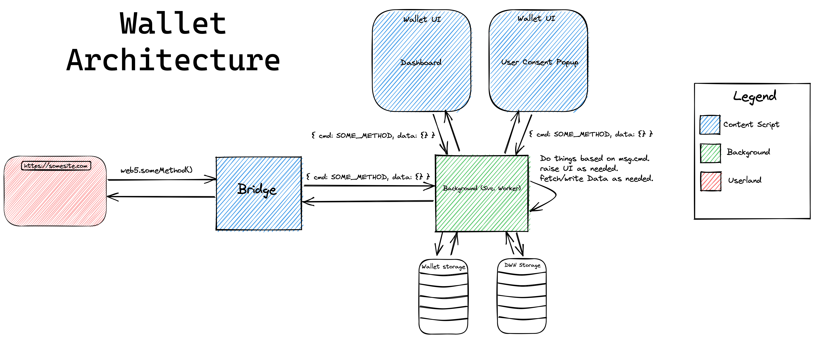

# Web5 Browser Wallet <!-- omit in toc -->

A browser extension web5 wallet

- [Introduction](#introduction)
- [Installation / Usage](#installation--usage)
- [Architecture](#architecture)
  - [Architecture Elements](#architecture-elements)
    - [Web Page](#web-page)
    - [Bridge](#bridge)
    - [Background Service Worker](#background-service-worker)
    - [Wallet UI](#wallet-ui)
- [Project Resources](#project-resources)
# Introduction
The primary motivation for this project is to provide an entrypoint to the web5 ecosystem for end-users and developers. More specifically, this wallet aims to: 

- Provide end-users with a place to store, manage, and provision permissioned access to their identity which is made up of DIDs, Verifiable Credentials, and personal data.
- Provide developers with a [prollyfilled](https://twitter.com/slexaxton/status/257543702124306432) API injected by the wallet onto the global `window` object at `window.web5` to build web5 apps. The methods provided by this API enable developers to:
  - Initiate passwordless registration / login flows using DIDs 
  - Issue and request verifiable credentials
  - Request access, read, write, and subscribe to independently verifiable user data

Our overall goal is for there to be many wallets developed by anyone who chooses to do so. In fact, we'll have failed if we're the only wallet in town. Individuals should be able to choose whichever wallet best suits their needs and feels most intuitive. Moreover, individuals should not fall victim to vendor lock-in. 

In order to make this possible, we've started to define a wallet agnostic `web5` API that can be implemented by any wallet. This will enable consistency and interoperability across clients and applications. We intend to use as many existing standards as possible in addition to working alongside anyone who chooses to participate to develop any standards that may be missing. We encourage anyone and everyone who's interested to get involved! Initial thoughts on the web5 API can be found [here](./rfc/web5-api.md)

# Installation / Usage
```bash
git clone https://github.com/TBD54566975/web5-wallet-browser
cd web5-wallet-browser/external
npm install
npm run build
```

* pop open a chrome window
* navigate to chrome://extensions
* toggle Developer Mode on (toggle should be on top right)
* click on Load Unpacked
* navigate to `web5-wallet-browser`
* select the `extension` directory. The extension should now appear in the tiled list of installed extensions
* click the puzzle icon to the right of the omnibar
* click the pushpin icon next to Janky Wallet

⚠️ _TODO: include video showing installation steps_

# Architecture


_[source](./diagrams/wallet-architecture.excalidraw)_

## Architecture Elements
The wallet's architecture is comprised of 4 different elements/contexts:

### Web Page 
_Also referred to as "Userland"_

This is where an application's javascript runs. Access to a user's identity/data is facilitated by calling methods exposed by the `web5` API. Any/all actions pertaining to user-data access is guarded by explicit user consent that is raised and controlled by the background service worker. A web page will only be able to access or write user data after user consent is granted.

### Bridge
The Bridge is a [content script](https://developer.mozilla.org/en-US/docs/Mozilla/Add-ons/WebExtensions/Content_scripts) that is loaded alongside every webpage. It has has two responsibilities:
- Inject the `web5` API onto the `window` of a given web page
- Act as a delegate by proxying messages between userland <-> background

The Bridge has the exact same limitations that a [Web Page](#web-page) does. The only distinguishing factor is its ability to send mesages to the background service worker. The injector has no elevated or privileged access to user data. Messages sent by the bridge are identified by the `origin` property set by the browser.

### Background Service Worker
The [background service worker](https://developer.mozilla.org/en-US/docs/Mozilla/Add-ons/WebExtensions/Background_scripts) context is the heart and soul of the wallet and has direct access to read and write user data. You can think of it as the wallet's "backend". The background service worker is communicated with via messages that contain a `cmd` property. This `cmd` property dictates the action taken by the service worker. 


Not all contexts are allowed to run every available `cmd`. For example, UI raised by the wallet can send commands that the injector can't and vice versa. Additionally, commands sent by the injector on behalf of a web page will often cause the background worker to raise a user consent popup at least once to ensure that the user has an explicit choice to consent/decline a Web App's intent.

### Wallet UI
Wallet UI is always raised by the background service worker using [`browser.windows.create`](https://developer.mozilla.org/en-US/docs/Mozilla/Add-ons/WebExtensions/API/windows/create) and can communicate directly with the background service worker. Windows created by an extension's background service worker are effectively considered as [content scripts](https://developer.mozilla.org/en-US/docs/Mozilla/Add-ons/WebExtensions/Content_scripts). The wallet UI context has access to more commands than the injector context. Examples of Wallet UI include:
- The dashboard that is rendered when the extension popup is clicked. 
- User consent popups that are rendered as an effect of userland calling a `web5` method that requires user consent before proceeding. 

# Project Resources
| Resource                                   | Description                                                       |
| ------------------------------------------ | ----------------------------------------------------------------- |
| [CODEOWNERS](./CODEOWNERS)                 | Outlines the project lead(s)                                      |
| [CODE_OF_CONDUCT.md](./CODE_OF_CONDUCT.md) | Expected behavior for project contributors, promoting a welcoming |
| [CONTRIBUTING.md](./CONTRIBUTING.md)       | Developer guide                                                   |
| [GOVERNANCE.md](./GOVERNANCE.md)           | Project governance                                                |
| [LICENSE](./LICENSE)                       | Apache License, Version 2.0                                       |
